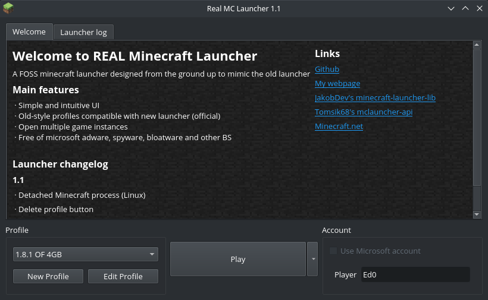

### Real-MC-Launcher

Real MC launcher is a minecraft launcher designed from the ground up to mimic the old launcher, both in appearance and functionality.
It's coded in PyQt5 using [minecraft-launcher-lib](https://minecraft-launcher-lib.readthedocs.io/en/stable/index.html#)



#### Features
- Simple and intuitive UI
- Old-style profiles compatible with new launcher (official)
- Open multiple game instances
- Free of microsoft adware, spyware, bloatware and other BS

#### Missing
- Currently does not support microsoft accounts
This could be easily implemented, but in order to do this I would have to create and Azure platform Client ID. This is fine except for the fact that I have to give microsoft my phone number and full address, which I'm quite not so fine with, but I will probably do sometime in the future.
Even then, I will probably never release a version with my Client ID embedded cause I don't want it to be somehow leaked, so even if the functionality is some day there, it will not work out of the box without entering an azure Client ID.

#### More
- The launcher has been tested in minecraft versions: 1.8.x, 1.12.x, 1.16.x and 1.19.x. But it probably works with all releases and snapshots
- Optifine has been tested
- Forge has been tested

#### Building 
Project dependencies are:
- pyqt5
- minecraft-launcher-lib

You can build an executable by installing [pyinstaller](https://pypi.org/project/pyinstaller/) and running 
```
pyinstaller launcher.spec
```
